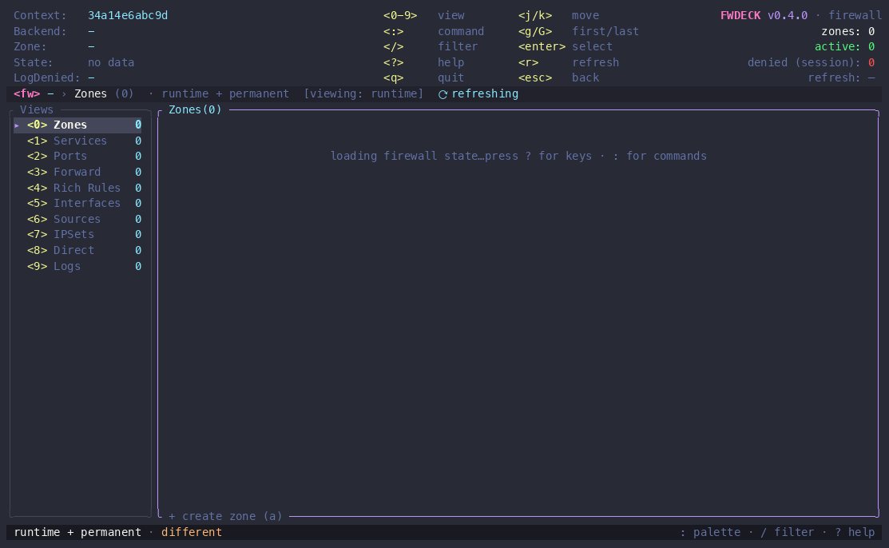

<div align="center">
    <a href="https://github.com/madebydaniz/fwdeck/actions/workflows/ci.yml">
        
    </a>
    <a href="https://github.com/madebydaniz/fwdeck/releases">
        
    </a>
    <a href="https://crates.io/crates/fwdeck">
        
    </a>
    <a href="https://github.com/madebydaniz/fwdeck/actions/workflows/release-binaries.yml">
        
    </a>
    <a href="LICENSE">
        
    </a>
</div>

<br>

<div align="center">
  <picture>
    <source media="(prefers-color-scheme: dark)" srcset="assets/logo-dark.svg">
    
  </picture>
  <h1>FWDeck</h1>
</div>

FWDeck is a safety-first terminal UI for **firewalld** — manage your Linux
firewall the way k9s manages Kubernetes: fast, keyboard-only, and with a
confirmation in front of anything that could lock you out.



## Requirements

- **Linux with firewalld** — `firewall-cmd` on your `PATH`. (Or use `--offline`
  to edit the permanent config with the daemon stopped, e.g. from a rescue shell
  or chroot.)
- **Root or polkit authorization** to make changes. Without it, FWDeck runs
  read-only with a visible explanation and never re-executes itself with `sudo`.
- **systemd + root** for the crash-proof rollback watchdog. Where they aren't
  available (many containers, minimal systems), the dead-man's switch degrades
  to in-process rollback.

## Install

Pick your platform's package manager:

| Method | Command |
| --- | --- |
| **crates.io** (compile) | `cargo install fwdeck --locked` |
| **Prebuilt binary** (no compile) | `cargo binstall fwdeck` |
| **Nix** | `nix profile install github:madebydaniz/fwdeck` |

AUR and Copr packaging files ship in [`packaging/`](packaging/) — hosted
AUR/Copr repositories are on the roadmap.

Or grab a native **`.deb` / `.rpm`** (amd64 & arm64) from every
[release](https://github.com/madebydaniz/fwdeck/releases) — download the one for
your architecture, then:

```bash
sudo apt install ./fwdeck_*.deb    # Debian/Ubuntu
sudo dnf install ./fwdeck-*.rpm    # Fedora/RHEL
```

Prebuilt signed binaries (`x86_64`/`aarch64`, glibc & static musl) with shell
completions and a man page are on the same releases.

Prefer a script? It verifies the SHA-256 checksums and the Cosign release
signature before installing. Read it first, then run it:

```bash
curl -fsSL https://raw.githubusercontent.com/madebydaniz/fwdeck/main/scripts/install.sh -o install-fwdeck.sh
less install-fwdeck.sh    # inspect before running
bash install-fwdeck.sh
```

Once installed:

```bash
fwdeck doctor        # checks your environment — never touches the firewall
fwdeck prune --dry-run # previews bounded local-state retention
fwdeck --read-only   # look around safely; mutations are disabled
sudo fwdeck          # full control
```

Development version (latest `main`, unreleased):

```bash
cargo install --git https://github.com/madebydaniz/fwdeck --locked
```

> FWDeck is distributed as an application. Its Rust library API is internal and
> not currently covered by semantic-versioning guarantees.

## Features

- ⏱️ **Dead-man's switch** — risky changes auto-revert on a countdown unless you
  confirm your session still works. An out-of-process systemd watchdog is
  pre-armed *before* the change is applied, so the revert survives a crash,
  `SIGKILL`, or dropped SSH session.
- 🔍 **Runtime vs permanent** scope on every row — you always know what survives
  a reload.
- 📋 **Staged plans** — batch changes, review once, apply once; or export as a
  `firewall-cmd` script, JSON, or Ansible playbook.
- 🧷 **Stale-state guard** — every mutation carries the exact snapshot reviewed
  at confirmation. The engine bypasses refresh caches, revalidates, and fails
  closed if firewalld changed before execution.
- 🚨 **SSH-aware** — warns precisely when a change targets the zone your session
  depends on.
- 📸 **Snapshots** with diff-based restore (staged, never automatic), read-only
  snapshot/session diffs, pinning, and bounded enterprise retention.
- 🧯 **Offline mode** (`--offline`) — fix the permanent config from rescue/chroot,
  no daemon needed.

<details>
<summary><strong>Full feature list</strong></summary>

- 🧭 Every firewalld object on one screen: zones, services, ports, source-ports, protocols, forwards, rich rules, interfaces, sources, ipsets, policies, direct rules — plus per-zone target, intra-zone forwarding, and icmp-block inversion.
- ✅ A confirmation in front of every mutation: resource, zone, scope, connectivity risk.
- 🧙 Guided rich-rule builder — assemble valid rich-language syntax step by step.
- 🧭 Fail-closed direct-rule migration assistant — preview and create additive
  policy candidates for a conservative subset; legacy rules are never removed automatically.
- ↩️ Multi-level undo — every verified reversible change stacks; undo pops the most recent.
- 📊 Live nftables rule-hit counters per chain (nftables backend).
- ⌨️ Fuzzy command palette (`:`) with context-aware availability; live filtering (`/`); global search (`ctrl-f`) across every view at once.
- 🗑️ Multi-select bulk delete with one reviewed confirmation.
- 📜 Live kernel/netfilter log tail with a denied-packet counter.
- 🪪 Honest results: partial failures reported as partial failures, with per-step diagnostics and a private, rotated JSONL audit trail.
- 🧱 Concurrent-change protection: stale single operations and whole staged
  plans are rejected before commands or rollback guards start.
- 🧹 Configurable local-state retention with safe defaults, dry-run/apply CLI,
  pinned snapshots, strict filename matching, and symlink refusal.
- 🔌 Two backends behind one trait: `firewall-cmd` (default, full-featured) and native D-Bus (reads + runtime edits; refuses what it can't do fully).
- 🔏 Every release checksummed and signed with Cosign keyless (Sigstore).
- 🩺 `fwdeck doctor`, shell completions, man page, XDG config, three themes.

</details>

## Compatibility

Every release is tested against a **real firewalld daemon** in CI on:

| Distro | firewalld | Status |
| ------ | --------- | ------ |
| Fedora 44 | 2.4.x | ✅ CI |
| Debian 13 | 2.3.x | ✅ CI |
| AlmaLinux 9 (RHEL-compatible) | 1.3.x | ✅ CI |

## Documentation

- [Getting started](https://madebydaniz.github.io/fwdeck/docs/#introduction)
- [Installation & release verification](https://madebydaniz.github.io/fwdeck/docs/#installation)
- [The interface & views](https://madebydaniz.github.io/fwdeck/docs/#interface)
- [Workflows — multi-step tasks, exact keystrokes](https://madebydaniz.github.io/fwdeck/docs/#workflows)
- [Safety features](https://madebydaniz.github.io/fwdeck/docs/#safety)
- [Configuration](https://madebydaniz.github.io/fwdeck/docs/#configuration)
- [FAQ & troubleshooting](https://madebydaniz.github.io/fwdeck/docs/#faq)

## Try it safely

No firewalld on your machine, or don't want to touch it? The dev container runs
a **real firewalld** with seeded data, fully isolated from your host:

```bash
git clone https://github.com/madebydaniz/fwdeck.git && cd fwdeck
docker compose run --rm dev
cargo run   # inside the container
```

> If the build can't reach crates.io (Docker's DNS is flaky on macOS), run
> `make warm` once to fetch the dependencies into a cached volume, then
> `make run` builds and launches fully offline — no container network needed.

## Why did I build it?

Managing firewalld means the same loop every time: `firewall-cmd --list-all`,
scroll, `--add-service`, forget `--permanent`, `--reload`, check again, lose
track of which change was runtime-only. One mistyped rule on a remote box can
cost you the SSH session you're typing in. I wanted the k9s experience for
firewalld: everything visible on one screen, every change reviewed before it
lands, and a safety net when a change goes wrong. Nothing like it existed —
firewalld has no official TUI — so I built it.

## Alternatives

- [Cockpit](https://cockpit-project.org/): a great web console with a firewall
  page. It covers services and ports, but not rich rules, masquerade, policies,
  or ipsets — and it's a web service you have to run on a firewall host.
- [firewall-config](https://firewalld.org/): the official GTK GUI — needs a
  desktop session, so it rarely helps on servers.
- [Webmin](https://webmin.com/): manages firewalld among many other things via
  web UI; heavier footprint and again a web service on the host.
- Raw `firewall-cmd`: always works, and FWDeck never hides it — every applied
  step is recorded as the exact equivalent invocation. FWDeck is the review
  layer, not a replacement.

## Support

If FWDeck saves you from one locked-out SSH session, drop a ⭐️ on the repo!

- Bugs & feature requests: [GitHub Issues](https://github.com/madebydaniz/fwdeck/issues)
- Security reports: see [SECURITY.md](SECURITY.md) — please use private reporting

## License

FWDeck is licensed under the [MIT License](LICENSE) and maintained by
[Daniel Niazmand](https://github.com/madebydaniz) · [madebydaniz.com](https://madebydaniz.com).
